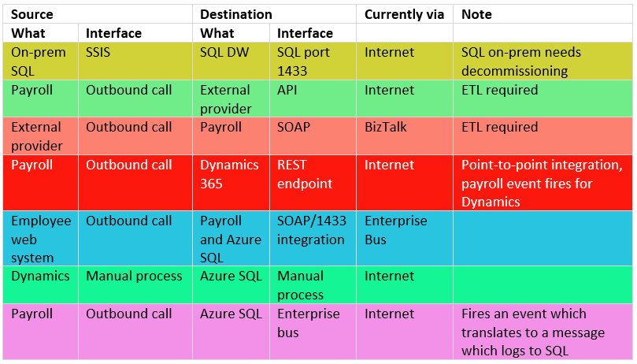
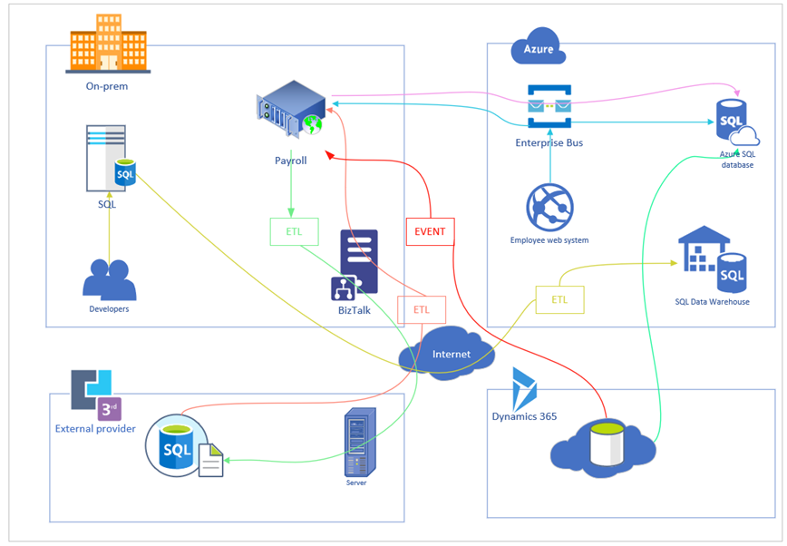

# Integration workshop whiteboard design session student guide

## Abstract and learning objectives

In this whiteboard design session, you will work with a group to design a technical architecture solution to modernize Fluffy Duck's integration platform while meeting their business requirements. To ensure needs are met and the platform is modernized, it's important to work as a team to think of technologies and solutions you haven't used in production before. The goal is to use Azure iPaaS services (and other Azure services!) as 'glue' for the different actors in the scenario, while providing a way for the on-premises components to securely communicate with these services. You will also design fault-tolerance and a regional failover plan of the Azure components.

By the end of this whiteboard design session, you will have a better understanding of how to modernize an integration platform in a 'cloud-native' perspective, taking advantage of the many services Azure provides to enhance functionality.

## Step 1: Review the customer case study

**Outcome**

Analyze your customer's needs.

Timeframe: 15 minutes

Directions: With all participants in the session, the facilitator/SME presents an overview of the customer case study along with technical tips.

1. Meet your table participants and trainer.

2. Read all the directions for steps 1-3 in the student guide.

3. As a table team, review the following customer case study.

### Overview
Fluffy Ducks co. is a large, multinational firm with offices in Melbourne (head-office, datacentre), Helsinki, and Ushuaia. The corporation has used biztalk of varying versions for the last 10 years to integrate on-prem -> on-prem and on-prem -> Azure. For data integration between disparate systems, they’ve relied on manual SSIS package execution on local DBA laptops. Fluffy Ducks co. have encountered multiple issues with both application and data integration and have convinced the business to invest in a modernization of their integration platform with a cloud-first approach where possible. 

### Current status
* BizTalk is end-of-life
* Local server hardware is reaching end-of-life and has had reliability issues, need to move SQL to the cloud
* Local developer laptops have become unstable when running SSIS packages, with no traceability or ability to roll-back changes, resulting in multi-day outages.
* The number of point-to-point integrations has grown substantially over time, increasing the administrative overhead exponentially. All of which differ in spec and API contract.
* When a point of integration is updated, this is an atomic change with no ability to rollback
* When an event happens in Dynamics, there is no automated way to check this
* Messaging to/from payroll into the cloud have a variable size limit; from kilobytes to multiple megabytes for things like PDF exchange
* Some payroll functionality migrating to d365, most functionality needs to be migrated into Azure, with a seperate backend and front-end. Keep in mind, some legacy endpoints and data will remain on-prem
* Business has appetite for innovation and redesign of current architecture

#### Business requirements
* When a new-hire is created in payroll, that same employee information is automatically created/synced to down-stream systems
* Reduce the amount of downtime currently experienced with changes, subsequently increasing the agility of the business
* Decrease the amount of administrative overhead
* Provide a better experience when working with partner organizations (onboarding, data and API exchange, documentation)
 
### Integration Systems
**Note: Row colour correlates to flow in diagram**

#### Technical requirements
* Must replace BizTalk with a solution
* Must ensure DBAs don’t have to run SSIS packages locally
* Payroll system has ability to call out (HTTP, webhook, etc.), provides a SOAP interface to call in
* Payroll system VM needs to migrate to Azure, with seperate back-end API and front-end
* Employee web system currently in Azure needs to be modernized to a seperate back-end API and front-end
* On-prem SQL needs to be replaced with cloud solution (such as Cosmos)

#### Assumptions
* Moving forwards, ExpressRoute exists from on-prem into Azure
* Organization is not limited to what they can deploy into Azure
* Azure SQL can be re-architected to Cosmos to reduce complexity and moving parts
* Remember, business has appetite to redesign architecture and write/consume new services
* External provider remains the same

## Step 2: Design a proof of concept solution

**Outcome**

Design a solution and prepare to present the solution to the target customer audience in a 15-minute chalk-talk format.

Timeframe: 60 minutes

**Business needs**

Directions:  With all participants at your table, answer the following questions and list the answers on a flip chart:

1. Who should you present this solution to? What are core requirements and not-so-important needs? What new technologies have we researched and used?

2. How could we incorporate resiliency into our design?

**Design**

Directions: With all participants at your table, respond to the following questions on a flip chart:

*High-level architecture*

1. Without getting into the details, the following sections will address the details, diagram your initial vision for handling the top-level requirements for the on-premise systems, 3rd-party provider, and d365. You will refine this diagram as you proceed.

*On-prem SQL*

1. How would you recommend Fluffy Duck's move SQL to Azure? Can they modernize the data platform to something like Cosmos DB? Be sure to consider details implied by CSLA's requirements such as the ability to re-write services and use new tech. What's the benefits of doing this? Explain the details of any computations you make.

*Payroll system*

1. The system puts a message onto an enterprise service-bus - which technology will you use? What's the difference between service-bus and Azure storage queue? Why would you use one over the other? Explain the details of how and why... remember, the payroll system get's split up into on-prem and cloud components.

*3rd-party provider*

1. What actually has to change here? Is it anything with the provider, or perhaps the way Fluffy Duck's interfaces with the provider, by-way of an API gateway solution? Ensure to read the case-study carefully.

*Employee web system*

1. This is a single web system. While we are here, how could this be modernized to provide the capability for integration into and out of this system? Think of a micro-services design; with a backend-api and a front-end web platform.

*Thinking about APIs*

1. API's are a core part of integration, providing the common interface for any interested parties. THink about how these are deployed and managed, while connecting and exposing any on-premise systems.

*Resiliency*

1. What process would you recommend to the customer to failover in the event of an outage, ensuring their web applications and associated Azure services change over to a secondary region?

2. How long would a failover take and how much data could be lost, in terms of time?

**Prepare**

Directions: With all participants at your table:

1. Identify any customer needs that are not addressed with the proposed solution.

2. Identify the benefits of your solution.

3. Determine how you will respond to the customer's wants/needs/requirements.

Prepare a 15-minute chalk-talk style presentation to the customer.

## Step 3: Present the solution

**Outcome**

Present a solution to the audience in a 15-minute chalk-talk format.

Timeframe: 30 minutes

**Presentation**

Directions:

1. One table is the Microsoft team and the proctors/SME/audience is the customer.

2. The Microsoft team presents their proposed solution to the customer.

3. The customer asks any questions about the design.

4. The Microsoft team responds to the questions.

5. The next group presents their solution as per steps 1-4.

## Wrap-up

Timeframe: 15 minutes

Directions: Tables reconvene with the larger group to hear the facilitator/SME share the preferred solution for the case study.

## Additional references

| Description                                                  | Links        |
| :------------------------------------------------------------ | :--------------------------------- |
|Some pattners                                                  | Check out the patterns.md file in this repo |
| Azure Integration Services                                       |                              <https://azure.microsoft.com/en-us/product-categories/integration/>                              |
| Azure Logic Apps                                           |                 <https://azure.microsoft.com/en-us/services/logic-apps/>                  |
| Azure API Management                              |            <https://azure.microsoft.com/en-us/services/api-management/>            |
| Azure Service Bus             |             <https://azure.microsoft.com/en-us/services/service-bus/>             |
| Azure Event Grid                      |            <https://azure.microsoft.com/en-us/services/event-grid/>            |
| Azure Solution Architectures                               | <https://azure.microsoft.com/en-gb/solutions/architecture/>  |
| Azure Trust Center                                           |                                  <http://azure.microsoft.com/en-us/support/trust-center/>                                   |
| Azure API Design Guidance                          |   <https://docs.microsoft.com/en-us/azure/architecture/best-practices/api-design>    |
| Azure Data Factory                                           | <https://azure.microsoft.com/en-us/documentation/articles/data-factory-data-movement-activities/#data-factory-copy-wizard/> |
| Azure SQL Database                                           |                <https://docs.microsoft.com/en-us/azure/sql-database/sql-database-geo-replication-overview/>                 |
| Designing highly available services using Azure SQL Database |     <https://docs.microsoft.com/en-us/azure/sql-database/sql-database-designing-cloud-solutions-for-disaster-recovery>      |
