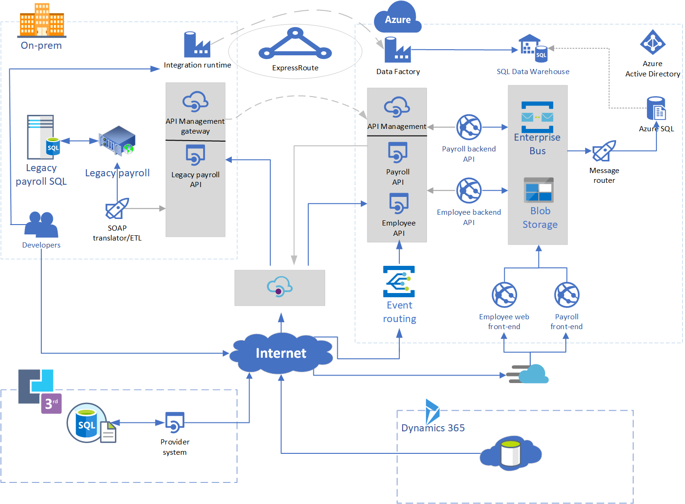

# Trainer information

Thank you for taking time to support the first whiteboard design sessions as a trainer!

## Role of the trainer

An amazing trainer:

- Creates a safe environment in which learning can take place.

- Stimulates the participant's thinking.

- Involves the participant in the learning process.

- Manages the learning process (on time, on topic, and adjusting to benefit participants).

- Ensures individual participant accountability.

- Ties it all together for the participant.

- Provides insight and experience to the learning process.

- Effectively supports the whiteboard design session discussion.

- Monitors quality and appropriateness of participant deliverables.

- Effectively leads the feedback process.

## Whiteboard design session flow

Each whiteboard design session uses the following flow:

**Step 1: Review the customer case study (15 minutes)**

**Outcome**

Analyze your customer's needs and logical diagram.

- Customer's background, situation, needs and technical requirements

- Current customer infrastructure and architecture

- Potential issues, objectives and blockers

**Step 2: Design a proof of concept solution (60 minutes)**

**Outcome**

Design a solution and prepare to present the solution to the target customer audience in a 15-minute chalk-talk format.

- Determine customer's business needs to address your solution.

- Design and diagram your solution.

- Prepare to present your solution.

**Step 3: Present the solution (30 minutes)**

**Outcome**

Present solution to your customer:

- Present solution

- Receive feedback

**Wrap-up (15 minutes)**

- Review preferred solution

## Before the whiteboard design session: How to prepare

Before conducting your first whiteboard design session:

- Read the Student guide (including the case study) and Trainer guide.

- Become familiar with all key points and activities.

- Plan the point you want to stress, which questions you want to drive, transitions, and be ready to answer questions.

- Prior to the whiteboard design session, discuss the case study to pick up more ideas.

- Make notes for later.

- Ask yourself 3 questions you don't want to be asked. Prepare answers for these questios.

## During the whiteboard design session: Tips for an effective whiteboard design session

**Refer to the Trainer guide** to stay on track and observe the timings.

**Do not expect to memorize every detail** of the whiteboard design session.

When participants are doing activities, you can **look ahead to refresh your memory**.

- **Adjust activity and whiteboard design session pace** as needed to allow time for presenting, feedback, and sharing.

- **Add examples, points, and stories** from your own experience. Think about stories you can share that help you make your points clearly and effectively.

- **Consider creating a "parking lot"** to record issues or questions raised that are outside the scope of the whiteboard design session or can be answered later. Decide how you will address these issues, so you can acknowledge them without being derailed by them.

***Have fun**! Encourage participants to have fun and share!*

**Involve your participants.** Talk and share your knowledge but always involve your participants, even while you are the one speaking.

**Ask questions** and get them to share to fully involve your group in the learning process.

**Ask first**, whenever possible. Before launching into a topic, learn your audience's opinions about it and experiences with it. Asking first enables you to assess their level of knowledge and experience, and leaves them more open to what you are presenting.

**Wait for responses**. If you ask a question such as, "What's your experience with (fill in the blank)?" then wait. Do not be afraid of a little silence. If you leap into the silence, your participants will feel you are not serious about involving them and will become passive. Give participants a chance to think, and if no one answers, patiently ask again. You will usually get a response.

-----

# Integration workshop whiteboard design session trainer guide

## Step 0.5: Cover some integration patterns and topics first

- Quickly go through the Azure Integration Services, and some other services such as functions

- Talk about how integration is a series of patterns and practices that fit together like lego or a puzzle - give exampls from the patterns.md

- Take some questions etc.

## Step 1: Review the customer case study

- Check in with your table participants to introduce yourself as the trainer.

- Ask, "What questions do you have about the customer case study?"

- Briefly review the steps and timeframes of the whiteboard design session.

- Ready, set, go! Let the table participants begin.

## Step 2: Design a proof of concept solution

- Check in with your tables to ensure that they are transitioning from step to step on time.

- Ensure tables don't get hung up on nitty-gritty details like Azure-AD - just get something on the whiteboard and refine.

- Provide some feedback on their responses to the business needs and design.

  - Try asking questions first that will lead the participants to discover the answers on their own.

- Provide feedback for their responses to the customer's objections.

  - Try asking questions first that will lead the participants to discover the answers on their own.

- Ask leading questions - "How has this design incorporated HA/DR?" ... "What are some ways you can connect a PaaS service on-prem?"

## Step 3: Present the solution

- Pick a table at random to go first

- Have the presenting team present their solution to the customer team.

  - Point out 3 good design considerations.

  - Ask why they chose a particular technology - e.g. azure storage queue over service-bus. Explain differences to the room.

  - Ask 2+ leading questions about doing something a different/better way.

## Wrap-up

- Have the table participants reconvene with the larger session group to hear the facilitator/SME share the following preferred solution.

## Preferred solution

Show the proposed solution in the visio folder in this repo.

*High-level architecture*

1. Without getting into the details, which you address below, diagram your initial vision for handling the top-level requirements for the points of integration, web applications, data management, and extensibility.

    

    - SQL migration
    - Data Factory
    - Web service split into microservices, front-end and back-end
    - Azure front-door
    - Service-bus for messaging
    - API-Management for exposing both on-prem and cloud interfaces, also acting as a forward-proxy for 3rd-party provider (TBD)
    - Azure-AD

    Azure API Management is used to create an API Store for development teams and affiliated partners. Azure SQL is used to remove administrative over-head of running a database platform, while providing much better scalability and resiliency. Azure Data Factory is used to perform some ETL functionality and to get data into Azure SQL and SQL data warehouse Both the employee websystem and payroll are split into microservices, independant front-end and back-end services. This enables both internal and external stakeholders integration points for those systems. The Azure Front-Door CDN capabilities sit in-front of the web services, providing global load-balancing, web offloading and WAF security. Service-bus is used as the enterprise service bus due to it's performance and message-size capabilities. The solution uses user and application identities maintained in Azure AD.

    > **Note:** The preferred solution is only one of many possible, viable approaches.

*Points of integration*

1. What are some of the patterns which can be implemented here?
    There are a few key patterns which can be easily identified and implemented with Azure services:
        * Message bus pattern (From service into Azure SQL)
        * Claims-check pattern (From services into Azure SQL)
        * Content enricher (Getting data from legacy payroll into Azure SQL) (TBD)

*Web Applications*

1. How should Fluffy Duck Co. implement the employee web system and payroll?

    They should implement a micro-services architecture for these web systems, at minimum splitting the front-end and back-end. This ensures each component can scale indepepndantly, and also provides an integration interface for other systems. This means the business can now leverage data and information of these systems, perhaps using AI+ML to perform predictive or classification analysis of certain datasets

2. What Azure service would host the web sites?

    The front-end could use an app service (If they're using something like MVC) or even sit in Azure Storage if they're using a javascript framework such as React. Both has pros and cons and there's no obvious right chouice.

    The back-end systems could use Azure Functions or app service. The technology choice would depend on the use case and requirements; functions could be used for very cheap whereas if there's long-running process such as webjobs or perhaps legacy requirements, app service would be a good choice.

3. What Azure services would provide access to the legacy payroll functionality?

    In this scenario, some of the payroll components cannot be migrated across and have to remain on-premise. We can put a logic app infront of the system and provision a secure api via API-Management. Logic Apps provide the flexability to connect to a variety of sources and provide transoformational and other logic on data passing in and out, maing them a good choice here.

    Logic Apps projects can be added to Fluffy Duck Co.'s Visual Studio solution, allowing the code to be managed as part of their DevOps workflow.

4. What recommendations can you make to help Fluffy Duck Co. manage its API inventory as it grows in the future? Are there services in Azure that can provide a proof of concept *API Store* experience now and serve as a path to development in the future?

    Fluffy Duck Co. should use Azure API Management. API Management provides the core competencies to ensure a successful API program through developer engagement, business insights, analytics, security, and protection. APIM has features to help Fluffy Duck Co. quickly build and scale an API ecosystem and grow into the future. APIs can be organized into Product groups to provide organization, and AAD integration comes out of the box. It will be relatively easy to develop new customer channels for affiliated partners and provide controlled discoverability and lifecycle management to development teams. Azure API Management does not have a strong opinion on change management but instead provides flexible options to handle API versioning and revisions.

*Data management*

1. What tools would you recommend Fluffy Duck Co. use to migrate its database? How would you use these? Be specific.

    The database migration should be handled using the [Azure Database Migration Service's](https://docs.microsoft.com/azure/dms/dms-overview) (DMS). DMS is a fully managed service designed to enable seamless migrations from multiple database sources to Azure Data platforms with minimal downtime. It provides customers with a comprehensive, highly available migration solution. The service uses the Data Migration Assistant to generate assessment reports that provide recommendations to guide you through the changes required before performing a migration. When you're ready to begin the migration process, the Azure Database Migration Service performs all of the required steps, following best practices as determined by Microsoft.

    > In addition to SQL database migrations, DMS can also be used for migrating other database types, such as MongoDB to Cosmos DB and MySQL and PostgreSQL migrations to the Azure Data Platform.

    Fluffy Duck Co. should use the online data migration capabilities of DMS to migrate their on-premises database into Azure SQL Database with minimal to no downtime. Data platform migrations should be approached with the same rigor and processes as a full software or hardware project, meaning a solid methodology is required for success.

    In planning their migration project, they should consider the process similar to that shown in the following graphic:

    

    *Pre-migration*:

    - **Discover**: Inventory your source database assets and perform an application stack discovery.
    - **Assess**: Assess source workloads and fix recommendations.
    - **Convert**: Convert the source schema to work in the target environment. This is only relevant for heterogeneous migrations.

    *Migration*:

    - **Migrate schema, data, and objects**: Migrate the source schema and then migrate the source data to the target.
    - **Sync data**: Sync your target schema and data with the source. This is only relevant for minimal-downtime migrations.
    - **Cutover**: Cutover from the source to the target environment. This is only relevant for minimal-downtime migrations.

    *Post-migration*:

    - **Remediate applications**: Iteratively make any necessary changes to your applications.
    - **Perform Tests**: Iteratively run functional and performance tests.
    - **Optimize**: Based on the tests you performed, address any performance issues, and then retest to confirm the performance improvements.

    In addition to DMS, Microsoft provides multiple tools for assisting with cloud migrations and upgrades of databases.

    *Database Migration Assistant (DMA)*

    The Data Migration Assistant (DMA) enables you to upgrade to a modern data platform by detecting compatibility and feature parity issues that can impact an upgrade or migration to your target version of SQL Server or Azure SQL Database. DMA also provides recommendations on performance and reliability improvements you can make once your databases have been migrated to your target environment. It allows you to move your schema, data, and uncontained objects (SQL Agent jobs, SSIS packages, roles, users, and logins) from your source server to your target server.

    *Database Experimentation Assistant (DEA)*

    The Database Experimentation Assistant (DEA) is an A/B testing solution for SQL Server upgrades. It assists in evaluating specific workloads against a targeted version of SQL Server or SQL Database. DEA is not a migration tool but can be used to help determine the appropriate target version of SQL Server or SQL Database for migrations.

    DEA guides you through running A/B testing by completing three steps:

    1. **Capture**: The first step of SQL Server A/B testing is to capture a trace on your source server. Trace files capture the entire query workload on that server.
    2. **Replay**: The second step of SQL Server A/B testing is to replay the trace file that was captured on your target servers, and then collect extensive traces from the replay for analysis.
    3. **Analysis**: The final step is to generate an analysis report by using the replay traces. The analysis report can help you gain insight into the implications of the proposed change.

    Using the analysis metrics provided by DEA, customers who are upgrading from an earlier version of SQL Server (starting with 2005) to a more recent version can identify compatibility errors, degraded queries and query plans, and other workload comparison data. The comparison data can lead to a higher confidence level and a more successful upgrade experience.

## Checklist of preferred objection handling

1. We have seen services like IFTTT (If This, Then That) that let business users automate processes. Does Microsoft Azure offer something similar?

    Yes, Microsoft Flow is a service that lets attendees and business professionals automate business processes.

2. Our developers have heard of Logic Apps. Will Microsoft Flow replace these?

    No, Logic Apps represent an "advanced" version of Microsoft Flow. The difference is the authoring experience (Logic Apps are implemented within the Azure Portal and Flows are implemented in the Flow portal) and that Logic Apps provide support for more developer centric tasks, such as integrating API Apps as custom actions, whereas Flow only provides pre-built actions.

    The following table helps you determine whether Microsoft Flow or Logic Apps is best for a particular integration:

    |     |                    |                |
    |-----|--------------------|----------------|
    |     | **Microsoft Flow** | **Logic Apps** |
    |Users | Office workers, business users, SharePoint administrators | Pro integrators and developers, IT pros |
    | Scenarios | Self-service | Advanced integrations |
    | Design tool | In-browser and mobile app, UI only | In-browser and Visual Studio, Code view available |
    | Application lifecycle management (ALM) | Design and test in non-production environments, promote to production when ready | Azure DevOps: source control, testing, support, automation, and manageability in Azure Resource Manager |
    | Admin experience | Manage Microsoft Flow environments and data loss prevention (DLP) policies, track licensing: Microsoft Flow Admin Center | Manage resource groups, connections, access management, and logging: Azure portal |
    | Security | Office 365 Security and Compliance audit logs, DLP, encryption at rest for sensitive data | Security assurance of Azure: Azure security, Azure Security Center, audit logs |

3. Is there a way to securely store application secrets in the cloud?

    Yes, Key Vault provides a mechanism to encrypt and securely store secrets within the confines of specialized hardware called Hardware Security Modules (HSM).

4. Moving everything to APIs sounds terrific, but how can we stay on top of our API inventory and manage discoverability, security, lifecycle, and monitoring into the future? Is there something we could use to develop a proof of concept quickly?

    Discoverability for development teams was a primary consideration in the development of Azure API Management. Access can be controlled through several provider models, including AAD. Concepts such as Policy Scopes and Expressions provide flexible options for fine-grained control and monitoring. In addition, when APIM is provisioned the instance will automatically have the capability to provide advanced analytics and Power BI visualizations, including ML-based analysis developed by Microsoft Research specifically for API management. A proof of concept that demonstrates all of these capabilities can be put together quickly and can easily be scaled up to create the API Store experience Fluffy Duck Co. is looking for.

5. We have been using .NET Framework for years, and now in Visual Studio web have options for .NET Framework, .NET Standard, and .NET Core. As we look at creating our new web and API applications, how do we choose the correct framework?

    *.NET Framework*

    .NET Framework is the "full" version of .NET that is distributed with Windows. This should be used when building windows only applications, such as a Windows app.

    *.NET Core*

    .NET Core is a cross-platform version of .NET that can run on Windows, Mac, and Linux. This should be used when you are building applications that need to run on any platform, including ASP.NET Core (cross-platform web applications).

    > .NET Framework and .NET Core are two different implementations of the .NET runtime, but they have different profiles of the many APIs and assemblies Microsoft has created for .NET.

    *.NET Standard*

    .NET Standard solves the code sharing problem for .NET developers across all .NET managed frameworks by providing a specification for implementing the base class library (BCL).