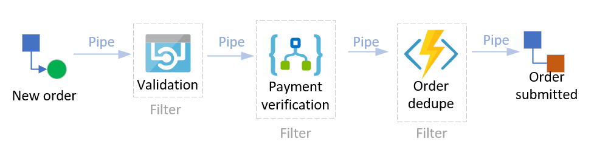
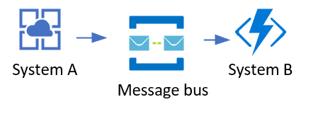
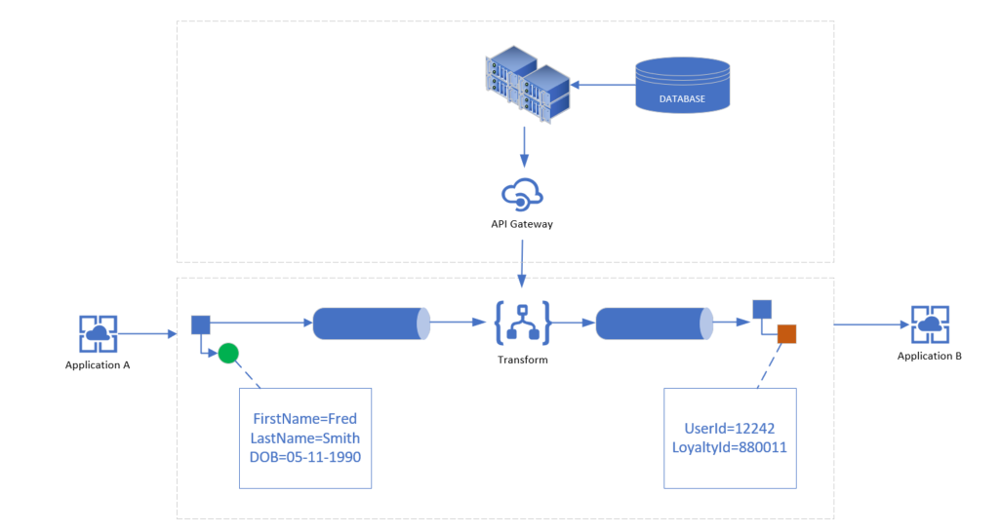
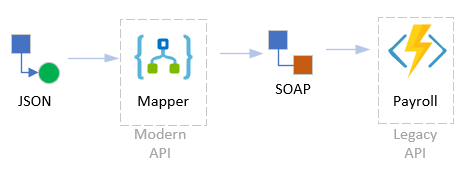

# Patterns

In this file, you will find an example of some integration patterns which are commonly seen.

https://www.enterpriseintegrationpatterns.com/patterns/messaging/

* Claim check
* Pipes and filters
* Message bus
* Message router
* Publisher-Subscriber (pub-sub)
* Content Enricher

## Claim check
### What is it?
The name "claim check" originates from a coat check at a show or movie; you leave your coat at the desk, and get a ticket. Upon returning the ticket, you receive your coat.

The claim check pattern follows a similar principle. Instead of putting an entire message onto a queue or topic, you put the message somewhere else (such as Azure blob storage), and put a reference to the body on the queue.

This pattern also helps to reduce costs, as storage is usually cheaper than resource units used by the messaging platform.

### Examples

### When to use this pattern
In most integration scenarios, the message will be of variable size. This means there will be outlier (or more) cases where the message is to big for the supported queue. This is especially true when more inefficient encoding standards such as XML are used, or when the message body can be a file such as an image or PDF.

As above, an example would be using Azure storage for both queue and blob. Azure storage queue has a maximum message size of 64kb; this size resitrictions might force you to use something else such as Azure service bus.

However, if you put the message body into blob storage, and your message onto the queue contains information about the body (such as a reference to the blob amongst other metadata items), you get around this size issue as your messages are always small.

This enables you to handle other files as your message body, such as a PDF or an image, both of which would usually be much to large for a queue

## Pipes and filters
### What is it?
When an event or message is generated or enters a given system, usually more than 1 operation or piece of logic is executed against that message. For example, when an new order is being submitted for an e-commerce platform, first the message might need it's contents validated (pricing for example), next there might be some payment verification process, lastly there might be a deduplication step to ensure the order is only placed once. Enter 'pipes and filters':

### Example

### When to use this pattern
One of the key benefits of this pattern is the opportunity for re-use; if all of the filter logic is contained inside of a single service, that service can only do one thing.

However, in the above example we have a payment verification filter. This filter could be re-used anywhere in the business where payment verification functionality is required.

Another key benefit of this pattern is the inherit design for asynchronous messaging. By seperating each functional component out into it's own service, you're able to build a resilient, non-blocking system with modular, discreet components. This ties directly into the message bus pattern.

## Message bus
### What is it?
Applications in an enterprise need to communicate and share data in a decoupled fashion. These applications operate independantly, but in a unified manner and conform to an overall design.

A message bus facilitates this pattern by providing a common infrastructure with a shared set of interfaces for systems to utilize. Services are able to submit messages as fast or slow as they like, with consuming services reading the messages in their own time as required.

### Example

### When to use this pattern
When you need reliable message delivery between multiple, seperate services which share a common model and form part of an overall system. These services don't have blocking/concrete dependencies and can continue to operate once the messages are placed/received onto the message bus.

## Message router
### What is it?
This pattern is similar to the pipes-and-filters pattern above, except the message router pattern has multiple output channels. The message router suite of services intelligently route messsages to a given backend depending on matched criteria. The message router pattern also deduplicates the number of seperate pipes and bus' required; because you have the shared message router there's a common place to send/receive messages.

The sender has no knowledge of how the message is routed (or to whome), just that their message has been published to the router.

### Example

### When to use this pattern
When you have multiple types of messages destined for multiple backend services, a message router is a good choice for a common point for message handling and routing.

## Publisher-Subscriber (pub-sub)
### What is it?
The pub-sub pattern is the ability for a given system to announce or broadcast an event, with 1 or more receivers consuming these events. This is achieved by way of a message channel, which communicates the event notifications so clients which subscribe to this channel.

Compare this to having a single channel per receiving application; this doesn't scale at all where instead you could have a single channel all receiving applications subscribe to.

### Example

### When to use this pattern
When you have an application which uses messaging to announce events, possibly to more than 1 receiver. It is also a pattern which can be used for debugging, as you can replay/eavesdrop on particular events or messages.

## Content Enricher
### What is it?
Another common pattern, when sending messages between systems, target systems may require more or modified information than what the message originally contained.

For example when a user is logging into an online platform. Certain services might require that, as well as the user identity, extra user details are provided for authorization such as their loyalty number.

Likewise, when the user inputs their postcode, this might be required to be transformed into their suburb.

The content enricher pattern achieves this by taking fields in the incoming message and enriching the message with data from an external source.

### Example

## When to use this pattern
When messages require hydration or enrichment before reaching destination systems, usually by external or seperate data and/or computation sources.

## Mapper
### What is it?
A simple pattern, the mapper pattern simply maps domain objects from one format to another. The most common scenario today is mapping from a REST endpoint using JSON, to a legacy SOAP or WSDL/WADL system.

This pattern lays way for app modernization; the ability to provide a modern interface to legacy systems. Products like Azure API-Management have this capability out-of-the-box, with a 1-click import process. This enables organization to very quickly provide modern interfaces to legacy systems.

### Example

### When to use this pattern
When there is the need to provide a one-to-one mapping from an interface to another. As mentioned above, most commonly this is exposing legacy SOAP type services as more modern REST endpoints.

If the interface needs to modify/transform or augment the message or data coming in, then the mapper pattern can be combined with other patterns such as transformation or content-enricher.
